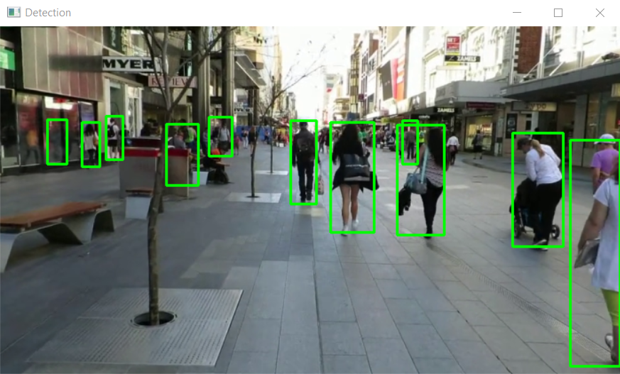

# 🚶‍♂️ Pedestrian Detection using OpenCV

This project uses **OpenCV** and **Python** to detect pedestrians in images or videos. It employs computer vision techniques to recognize and highlight pedestrians in real-time or pre-recorded footage.

## 📦 Installation

### 1️⃣ Clone the Repository

```sh
git clone [https://github.com/yourusername/pedestrian-detection.git]
cd pedestrian-detection
```


### 2️⃣ Create a Virtual Environment (Optional but Recommended)

```sh
python -m venv venv
```

Activate it:

**Windows:**

```sh
venv\Scripts\activate
```

**macOS/Linux:**

```sh
source venv/bin/activate
```


### 3️⃣ Install Dependencies

Run the following command to install all required packages:

```sh
pip install -r requirements.txt
```


## 🚀 Running the Project

Run the Detection Script:

```sh
python app.py
```

## 📊 Output / Results

Here are some sample outputs and a demo video of the pedestrian detection system in action.

🖼️ *Screenshots*

<p align="center">
  
</p>

🎥 *Demo Video*

<p align="center">
  
</p>


📝 Note:

## 🛠 Customization

Modify `cv2.VideoCapture()` in `detect_pedestrians.py` to:

* Use a video file → `cv2.VideoCapture("video.mp4")`
* Use a webcam → `cv2.VideoCapture(0)`

## ⚡ Features

* ✅ Real-time pedestrian detection
* ✅ Works with video files & live webcam feeds
* ✅ Customizable detection settings

## 🐍 Dependencies

The project requires the following Python libraries:

```sh
numpy
opencv-python
imutils
```
